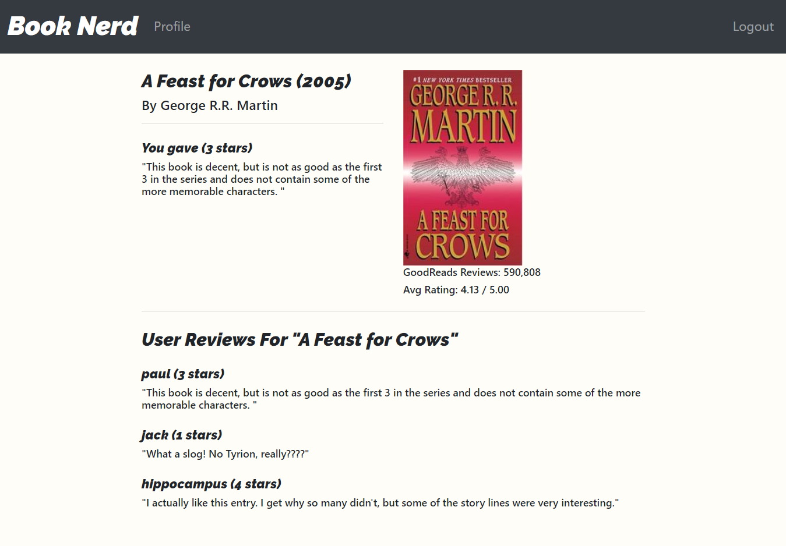

# Harvard CS50 Web Programming with Python and Javascript class project I (2018)

**In 2018 I took a Harvard Univeristy online course on Python web programming in order
to expedite the learning process for Python web development as well as to get real world
examples on the entire lifecycle of Python Flask and Django applications.** 

**The website listed below is a book rating app that I created for one of the class projects.
It is a Python Flask app and I focused more on the back-end Python programming side of things rather 
than creating a flashy front-end, so the visuals are not stunning by any means. 
That aside, the site is fully functional and contains user registration, account creation, 
search capablitlies, and a functional api. All data is stored in a postgresql database.**

### [Visit Site](https://booknerd.herokuapp.com/)

### [Sample API Link](https://booknerd.herokuapp.com/api/0451169514)

---

